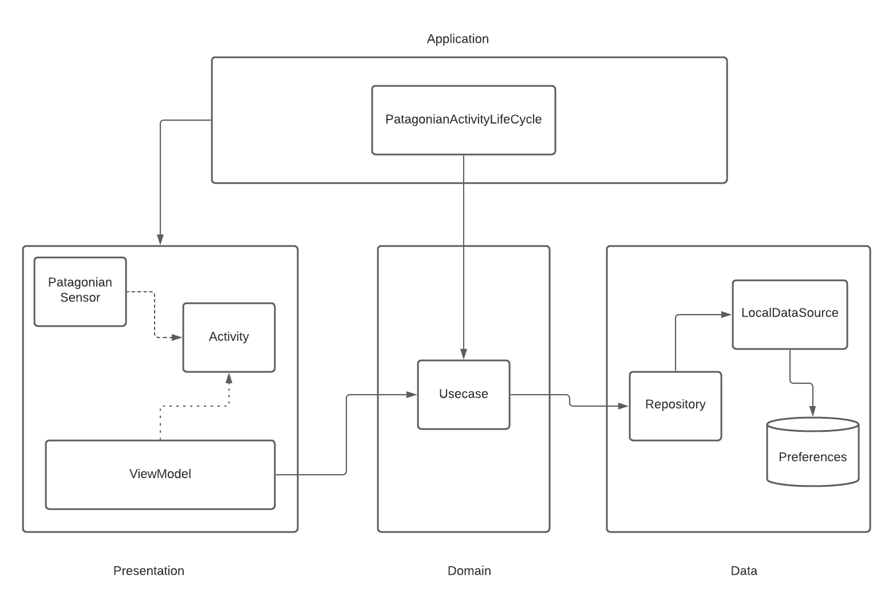

# Android Patagonian Challenge

Challenge for Android position: Create an application that increment a counter when goes to background and using the gyroscope, detect if the device is being rotated to the left or right in order to modify textsize.

## Design

Philosophy: Simplicity is the ultimate sophistication ( Leonardo da Vincy)

 

* Session Count Logic: For this requirement we have two options, the first was just to track the background step in the activity. The second one and what is more generic approach that can be used for any activity is tracking background callback at application level. Every time the app goes to background it will track this state independent of the current activity. Based on this, every time the app goes to backogrund, it saves the current time in milliseconds in SharedPreferences. When it is being resumed, the app verifies if the time between the last background state and the current resumed state is more than 10 minutes and only in this case it increment de counter. Since we are using data store we can listen changes in preferences, so every time the counter saved in preferences is being incremented, it is reflected in the textview. This was the simplest approach. Probably other solutions :
	* Use WorkManager to schedule a task for 10 minutes and then increment the counter. For this case we need to deal with doze mode in some cases and all the caveats from WorkManager.
	* Use AlarmManager to schedule a task for 10 minutes. There is an option to deal with doze mode. But probably some problems appears if the user turn reboot the device. Also, this proccess is made in background, but for this app making the validation in foreground is enough and fast.

* Gyroscope Logic: The first approach was to use the gyroscope sensor and sending values to the activity. But, these values need to be proccess with special algorithms in order to real metrics. Based on that, we decided to use [FSensor](https://github.com/KalebKE/FSensor) library, also we encapsule its functionality in a class / interface in order to preserve the abstraction of this functionality.

## Features

   * Divided in modules: presentation, domain and data layer 
   * DI: In order focus in the main tasks, this app is using manual DI, but it can easily change to Dagger2, Hilt or Koin
   * Basic Espresso for UI Testing
   * Unit testing for domain layer
   * ViewBinding for binding views
   * Keep the logic as simple as possible (Single Reposability Principle) in the domain layer.
   * In order to show abstractions and testing in real projects. This application is using interfaces for repository and data sources. In real projects it is very useful, but in this app is only using as delegating actions or methods.
   * Timber for show logs
   * For reactive streaming of gyroscope values, this app is using StateFlow. It allows to only propagates State when it change.
   * Data Store: Preferences for persistence

   
## Improvements
* Add Unit test to presentation and domain layer
* Add UI test for the rest of cases in presentation layer
* Implement DI framework/library such as Dagger2, Hilt or Koin
* Add better calibration algorithm for gyroscope values
* Add SecureSharePreferences for security purposes

## Author
Raul Guzman - [@RaulitoGC](https://github.com/RaulitoGC) on GitHub, [@rguzmanc161](https://twitter.com/rguzmanc161) on Twitter